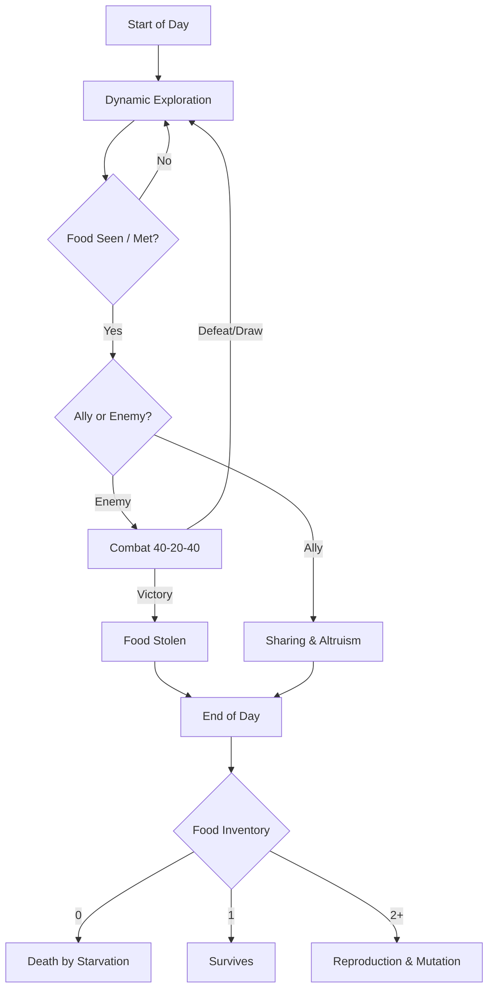

# AI Survival Strategy 🧬


A hybrid evolutionary simulator (Python Backend + HTML5 Canvas Frontend) designed to test genetic adaptation, altruism, and evolution in a competitive environment. Inspired by the logic of natural selection and game theory.

## 🚀 Key Features

- **Pseudo-3D Engine**: Carefully crafted isometric graphics featuring shadows, radial lighting for resources, and a dynamic "bobbing" effect for an organic walk cycle, all animated via HTML5 Canvas.
- **Genetic Logic**: Mutations across 5 core traits (Altruism, Efficiency, Size, Speed, Senses).
- **Probabilistic Combat System**: No more guaranteed "mathematical massacres". Battles are managed with a dynamic 40-20-40 (Win-Draw-Loss) logic, scaled based on the relative strength (size) of the two fighting units.
- **Fast-Forward & Auto-Stop**: Pre-settable conditions (Extinction, Single Race Monopoly, Day Limit, Population Limit) to halt the simulation and resolve macroscopic simulations instantaneously.
- **Report Export**: The integrated "Evolution Analytics Dashboard" allows you to download multi-page analytical PDFs and record WebM video timelapses of complete evolutionary outcomes (Generated by AI_AutisticIntelligence).
- **Multiple Scenarios**: Test complex ecosystems (Lone Wolf vs Pack, Traders vs Workers, The Hive Awakens) which can be loaded on the fly.

## ⚙️ Installation and Setup

1. Create a virtual environment and install the dependencies:
   ```bash
   python -m venv .venv
   source .venv/bin/activate  # On Windows: .venv\Scripts\activate
   pip install -r requirements.txt
   ```
2. Start the local FastAPI server:
   ```bash
   python -m src.server.main
   ```
3. Open your browser and navigate to `http://localhost:8000` to access the visual simulator.

## 🧠 AI Life Cycle


